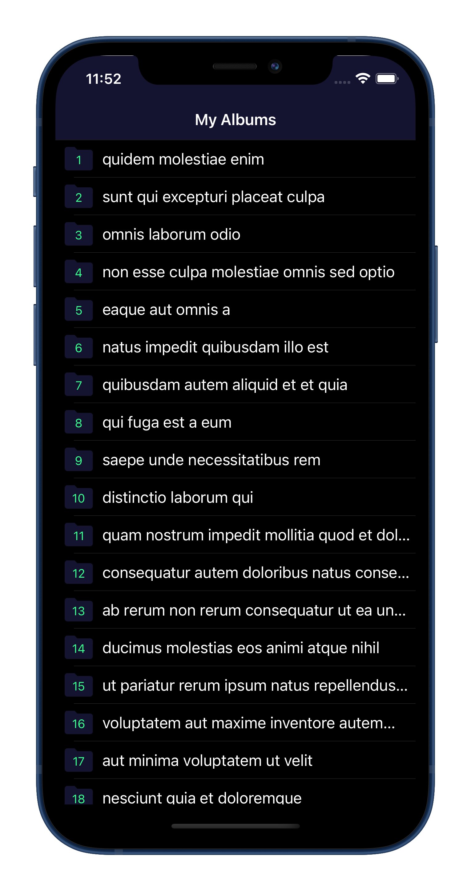

# PicturePinch

PicturePinch is test app that can browse photoalbums and photo's from a test API

## Goal

The goal was to write a clean and basic app, and make it look okay within a short amount of time. 

## Functionality

You can browse albums and the contents of an album. 
CleanSwift was used for 2 scenes, but routing was not implemented. Unit tests are the minimum, just for json parsing.

## Cocoapods

3rd party frameworks and libaries used:
```bash
- Alamofire for API calls
- AlamofireImage for simple image caching and downloading
- Realm to make the albums and pictures persistent
- SwiftyJSON for easy and type-safe json parsing
```

The PODS directory is ignored in the .gitignore file, because Github's file size limit.

 